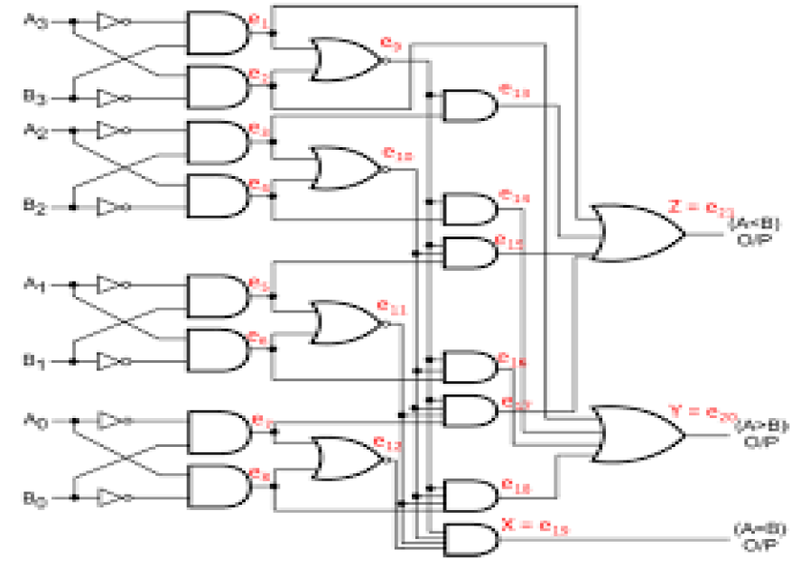
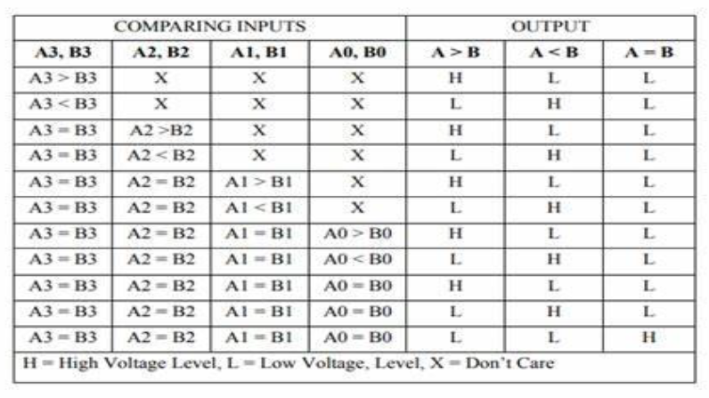
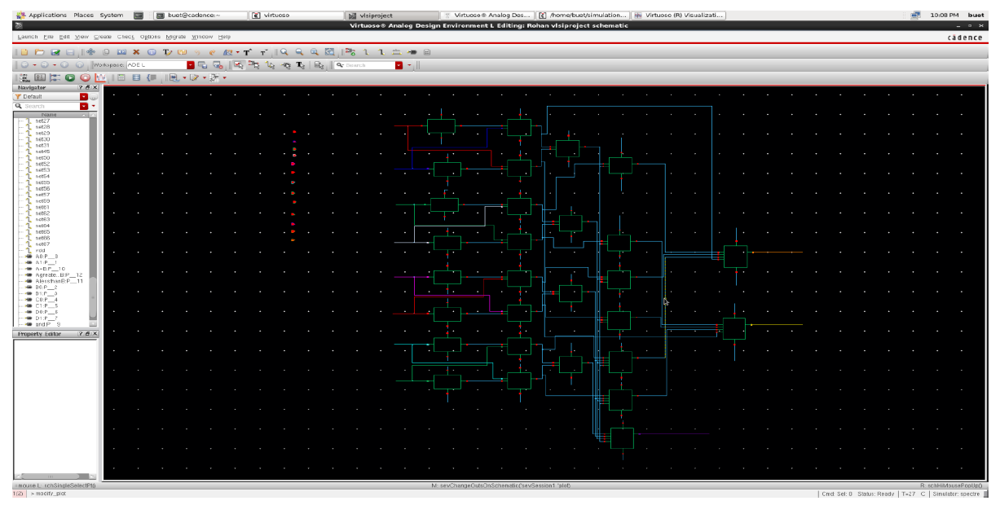
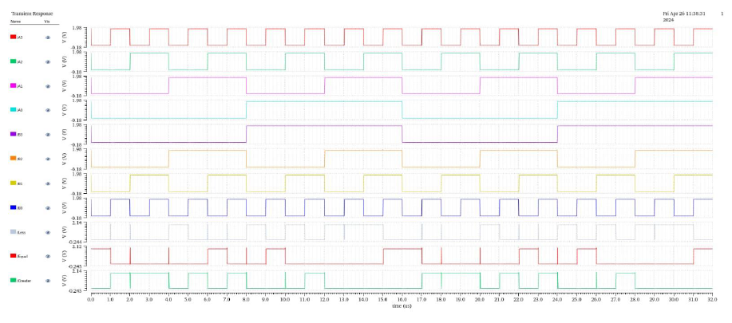
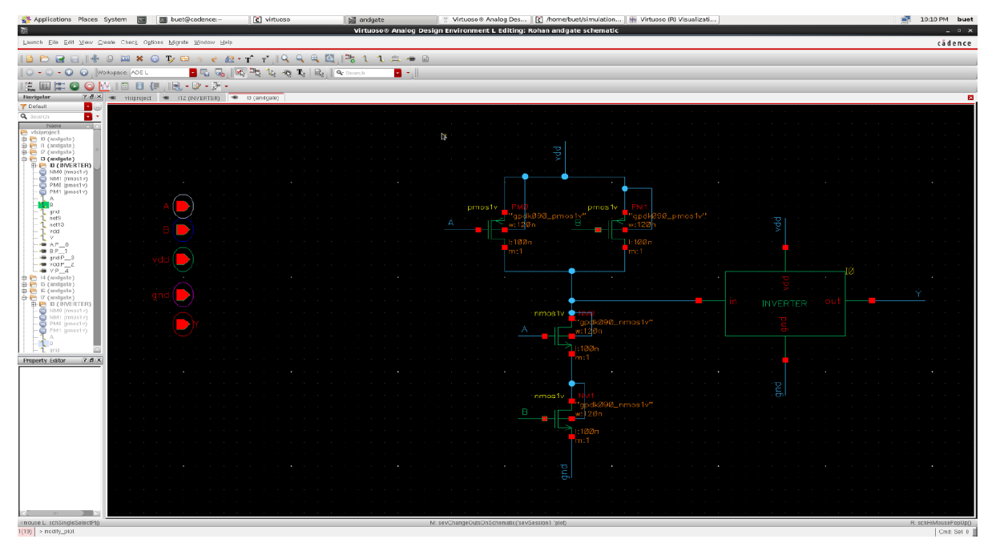
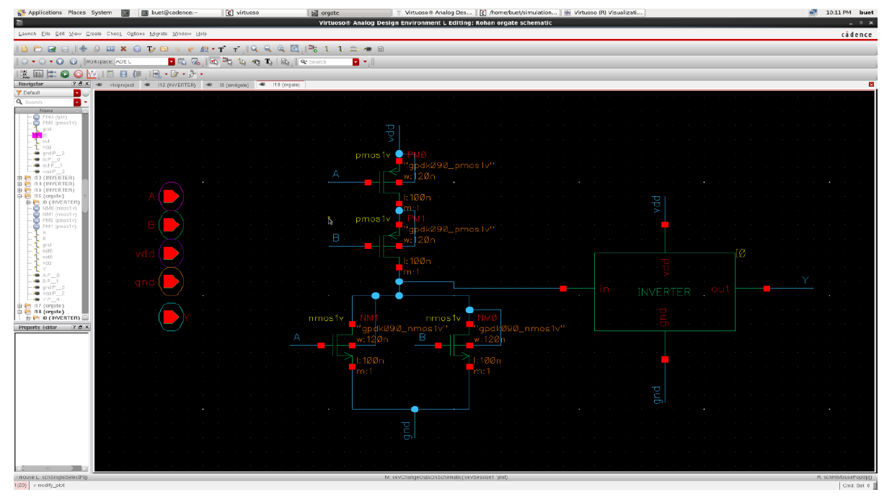
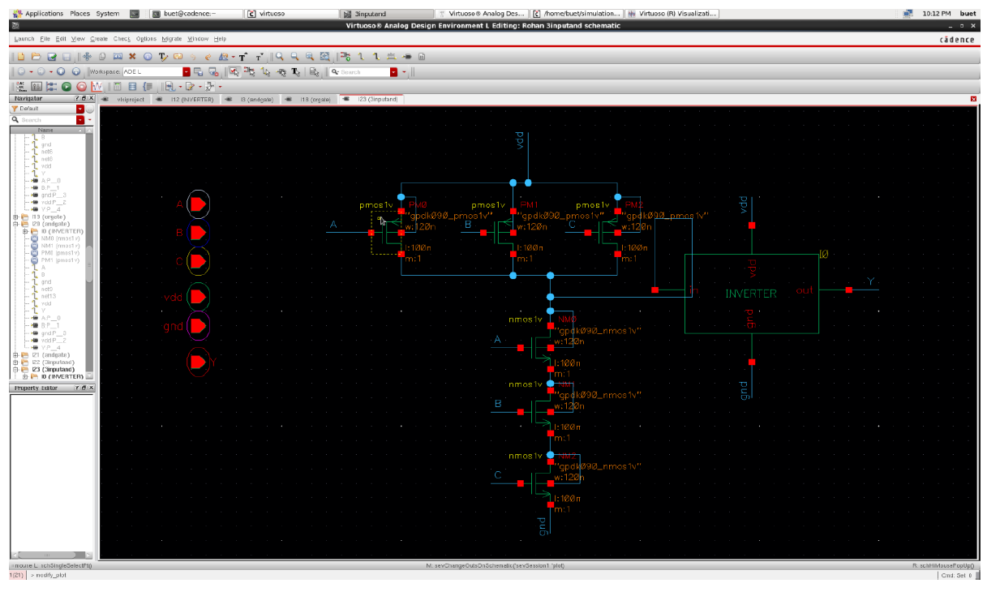
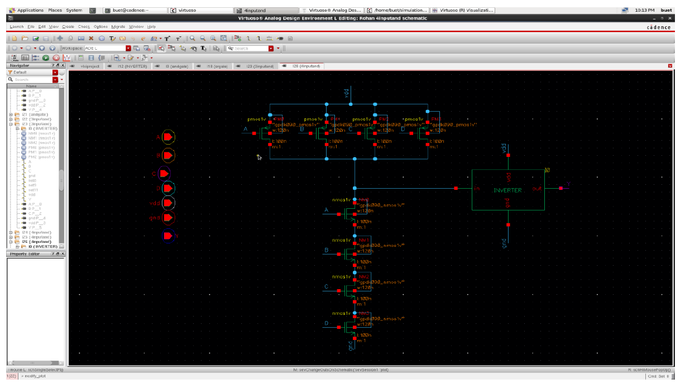
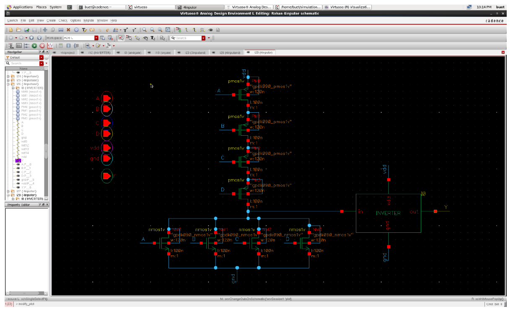

<h1> 4-Bit Magnitude Comparator</h1>

  
  
  
  
  
  
  

> ### VLSI System Design — VIT Chennai, April 2024  
> **Joseph Alex Valluvassery**

## Overview

This project compares two 4-bit binary numbers and generates three outputs:

- A > B
- A < B
- A = B

The design was implemented using PMOS and NMOS transistor-level logic and simulated using Cadence Virtuoso.

---

## Features

- CMOS-based transistor-level implementation
- Logic gate level comparator design
- Cadence Virtuoso schematic design
- Simulation and waveform verification
- Modular gate implementation

---

## Software Used

- Cadence Virtuoso

---

## Project Components

### Circuit Diagram

### Truth Table

### PMOS and NMOS Implementation

### Simulation Output

---

## Logic Gates Implemented

- Inverter
  
- 2 Input AND
  
- 2 Input OR
  
- 3 Input AND
  
- 4 Input AND
  
- 4 Input OR
  

---

## Working Principle

The comparator checks bits from MSB to LSB.

- If A > B → Greater output HIGH
- If A < B → Less output HIGH
- If A = B → Equal output HIGH

---

## Applications

- Arithmetic Logic Units (ALUs)
- Digital Signal Processing
- Microprocessors
- Embedded Systems

---

## Future Improvements

- Extend to 8-bit and 16-bit comparators
- Optimize power and area
- Improve propagation delay
- Implement layout-level optimization

---

## Authors

- Joseph Alex Valluvassery
